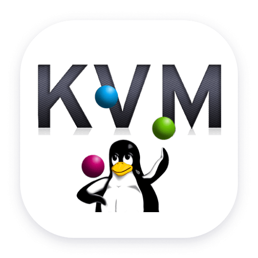

# Cloud Computing Course Laboratories

## Repository Structure

<a href="./lab1/README.md" style="display: flex; align-items: center; text-decoration: none;">
  
  Lab1 - Computing Virtualization with KVM
</a>

## License

This work is licensed under a **Creative Commons Attribution-NonCommercial-ShareAlike 3.0 Unported License**.

You are free:  
- **to Share**: to copy, distribute and transmit the work  
- **to Remix**: to adapt the work  

Under the following conditions:  
- **Attribution**: you must attribute the work in the manner specified by the author or licensor (but not in any way that suggests that they endorse you or your use of the work).  
- **Noncommercial**: you may not use this work for commercial purposes.  
- **Share Alike**: if you alter, transform, or build upon this work, you may distribute the resulting work only under the same or similar license to this one.  

More information on the [Creative Commons website](http://creativecommons.org).

  

## Acknowledgements

The author would like to thank all the people who contributed to this document

