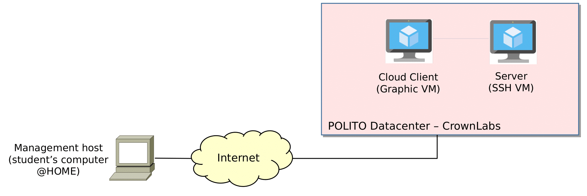
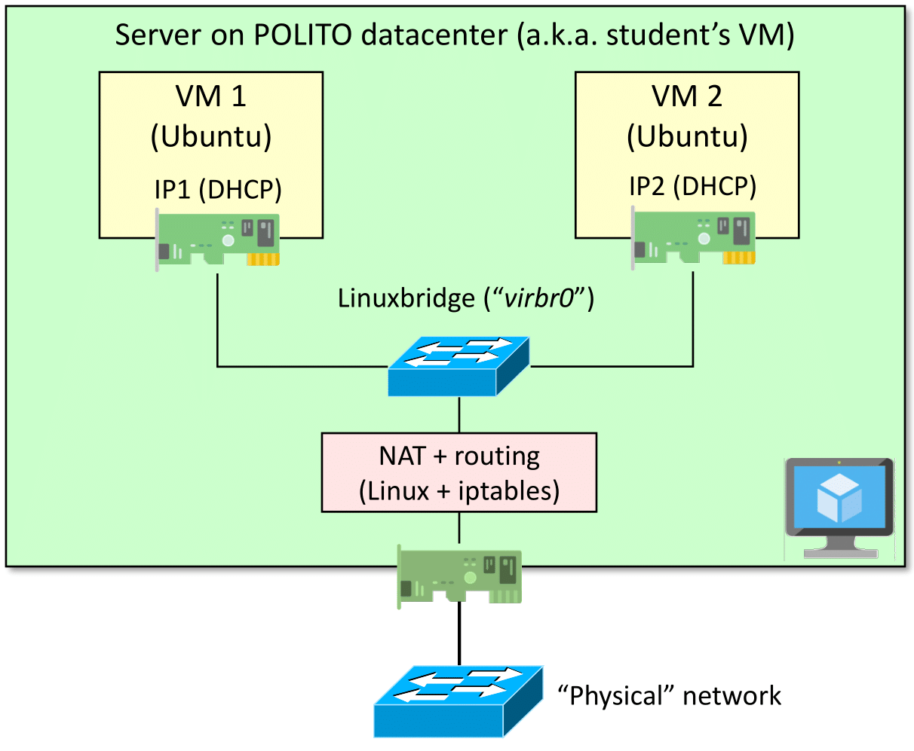

<table style="width:100%">
  <tr>
    <td align="left"><a href="../README.md">⬅️ Previous</a></td>
    <td align="right"><a href="../1.2/README.md">Next ➡️</a></td>
  </tr>
</table>

# 1. Practicing with virtual machines

While KVM supports the creation of a new VM by installing the guest OS from scratch, this lab suggests practicing with another option that is much more common in cloud environments: setting up an already installed VM in KVM.  
In fact, system administrators often start from an already installed VM and then customize it according to their needs instead of installing a Guest OS from scratch, which requires more time.

For this reason, major Linux distributions, such as Ubuntu, already provide pre-installed VMs targeting the cloud environment:

- **[Ubuntu Cloud Images](https://cloud-images.ubuntu.com/)** are the official pre-installed disk images that have been customized to run on public clouds that provide Ubuntu Certified Images, OpenStack, LXD, and more.  

- **[Ubuntu Minimized Cloud Images](https://cloud-images.ubuntu.com/minimal/)** are the official pre-installed disk images that have been customized to have a small runtime footprint in order to increase workload density in environments where humans are not expected to log in. More information at [Minimal Ubuntu Released](https://ubuntu.com/blog/minimal-ubuntu-released).  

**Note (1):** this lab will use the *Ubuntu Cloud Images*.  

**Note (2):** installation instructions for KVM can be found in *Appendix: Setup KVM*; here we just assume that KVM (and the additional modules such as the `virt-manager` GUI) are already set up in your environment.

## 1.1. Physical and logical setup

This lab requires a physical setup such as depicted in the figure below.  
Each student will be provided with two VMs running in the POLITO datacenter on the [CrownLabs platform](https://crownlabs.polito.it), one acting as **Client** and one representing our **server**.

The Client VM represents our **management host**, which is used to configure our (remote) server environment.

  

<em>Figure 1: Physical setup — how to connect to your virtualized resources.</em>

> [!NOTE]
> The case in which a **management host** connects and configures a **remote server** is very common in the real world.  
> Access to the server via console is rather uncommon, since it would require the system administrator to physically reside in the datacenter.  
>   
> However, the system admin must be very careful with the network configuration of the server: if wrong commands are issued, you may lose network connectivity to the server, hence the possibility to configure the machine.  
>   
> This is why servers in a datacenter are often provided with a parallel network that is used to *remotize* access to the server console, either in case of emergency or for the initial setup of the machine.

On the **server** side, this lab expects to create the configuration depicted in the next figure: two VMs connected to a L2 virtual switch (Linux Bridge), which is then connected to the Linux stack and from there to the Internet.  
KVM will insert all the required NAT rules and routing table in order to allow VM1 and VM2 to connect to the Internet.

  

<em>Figure 2: Logical setup — configuration expected in the target server at the end of the lab.</em>

---

Please note that, since our server itself is a virtual machine, this lab will use the concept of *nested virtualization*, as we will create a VM inside another VM.
