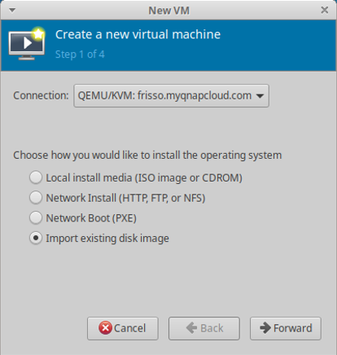
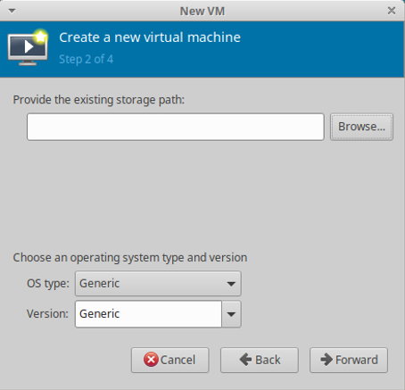
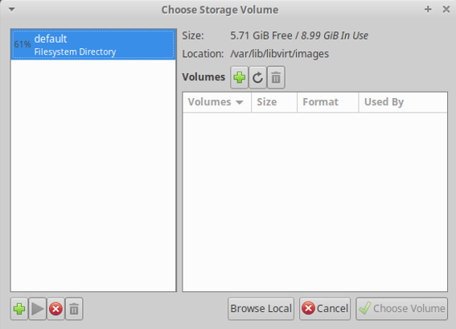
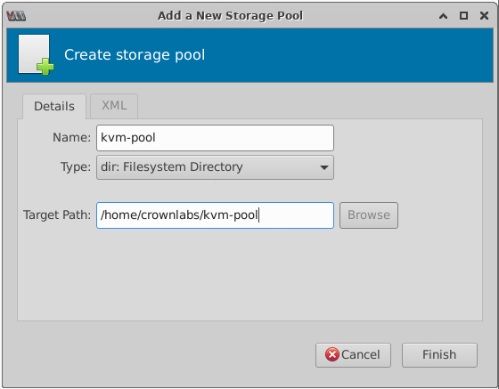
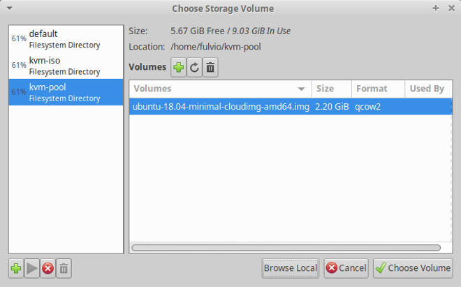
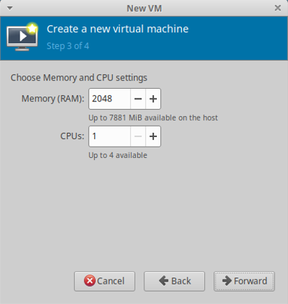
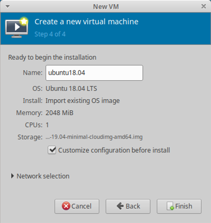
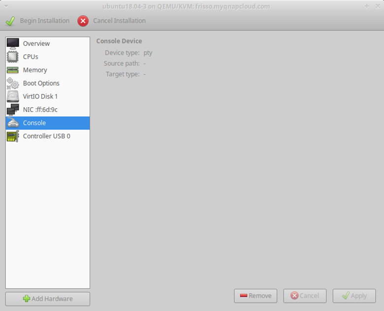

<table style="width:100%">
  <tr>
    <td align="left"><a href="../1.5/README.md">⬅️ Previous</a></td>
    <td align="right"><a href="../1.7/README.md">Next ➡️</a></td>
  </tr>
</table>

# 6. Create a new VM

In this step we operate on the **management station**, exploiting the GUI-based Virtual Machine Manager (`virt-manager`) that we presented in Section Setup Management Host.

1. Add a new connection to the server, either from the graphical interface (`file -> add connection`, then set the username and IP of the server), or leveraging the following command:

   ```bash
   virt-manager -c 'qemu+ssh://crownlabs@<SERVER_IP>/system?keyfile=<PRIVATE_KEY>'
   ```
   e.g.
   ```bash
   virt-manager -c 'qemu+ssh://crownlabs@10.100.101.102/system?keyfile=/home/netlab/.ssh/id_rsa'
   ```


> [!TIP]
> In case you use `virt-manager` to connect to a remote hypervisor through SSH, it is strongly encouraged to configure both server and client with SSH keys, as libvirt needs to open multiple SSH connections, one for each device (e.g., video card, keyboard, audio card, etc). Relying on classical `user/password` mechanisms would be annoying, since the user would be asked for the password several times.

> [!TIP]
> In case you prefer to connect to the remote hypervisor through username/password, you should install the `ssh-askpass` package on your client machine:
> ```bash
> sudo apt install ssh-askpass
> ```
> so that `virt-manager` can open a new window for you to type the password in.


> [!TIP] 
> In case you are connecting from remote using the ssh configuration file stored in your personal profile (folder `.ssh` in your home directory), the above command line is ignored, as everything (except the destination IP address) is read from the configuration file. Hence, you can simply use the traditional connection wizard (File → Add connection) and fill in the required data.

2. **Create a new VM** by going to *File > New Virtual Machine* (Figure: Create a new VM step 1).  
   You can either:

   - Select **Import existing disk image**, then click Forward.  
     This is the preferred choice in this lab, as we have already a pre-installed disk, namely the Ubuntu Cloud Image retrieved earlier.

   - Select **Local Install Media** (ISO image or CDROM), then click Forward: select this if you want to install a new VM using the installation disk. The install disk should be in ISO format.

   

   

   When you select the image location (ISO or pre-installed disk) by clicking *Browse*, a window *Choose Storage Volume* will appear. Initially it shows only the `Default` storage pool (`/var/lib/libvirt/images`).  
   Here you should configure the additional folders created before:

   - Select the `+` icon (bottom right) to add a new storage pool.
   - Choose a name for the new storage pool (e.g., `kvm-pool`), with type `dir: Filesystem Directory`; select the folder (e.g., `~/kvm-pool`) and press *Finish*.  
     Note: if you are connected to a remote machine, the *Browse* button may not work; in that case type the *Target Path* manually.
   - Repeat for the `~/kvm-iso` folder.

   
   

   After adding pools, you should see the default and new pools in the left pane (Figure below). Select the image/ISO and click *Choose Volume*.

   

   Then select the OS type (*Linux*), version (*Ubuntu 20.04*) and press *Forward*.

3. Select memory and CPU to allocate. Given the constrained environment, 512 MB RAM and 1 CPU are appropriate.

   

4. At the last step (Figure below), select *Customize configuration before install* to modify the virtual hardware and apply the following:

   - Remove unnecessary hardware (Display Spice, etc), keeping minimal configuration.
   - Add a new **disk device** used to load the `cloud-init` configuration created earlier.  
     Steps: *Add Hardware → Storage → Disk device → Select or create custom image* and choose the ISO created in the `cloud-init` step.  
     > **Note:** the second disk should be a disk device; CD-ROM devices do not work.
   - Expand the *Network Selection* section.
   - Ensure the VM is connected to the `default` virtual network with NAT. This allows Internet access using the hypervisor’s IP and bridged connectivity with other VMs on the same bridge.

   

   

You are now ready to start the VM and log in.

## 6.1. Start and customize the VM

You can now start the VM and log in with the credentials you set before.

Now install the tools to test connectivity and performance:

```bash
sudo apt update
sudo apt install iperf3 iputils-ping
```

## 6.2. Start a second VM

Repeat the steps to start a second VM.  
Use a fresh copy of the vanilla `.img` file and create another initialization disk for `cloud-init` (e.g., prompt name `test-vm2`).

> [!WARNING]
> Cloning the first VM is possible but troublesome, as not all `cloud-init` steps are re-executed and some identifiers (like network config) may conflict, leading to issues such as both VMs having the same IP.

## 6.3. Measure the network performance between the two VMs

To measure network performance between the two VMs:

- On VM1 (server):

  ```bash
  iperf3 -s
  ```

- On VM2 (client):

  ```bash
  iperf3 -c <VM1_IP_address>
  ```

where the IP address of VM1 can be found with:

```bash
ip addr
```

`iperf3` will run TCP traffic tests and output the average speed measured between the two machines.
