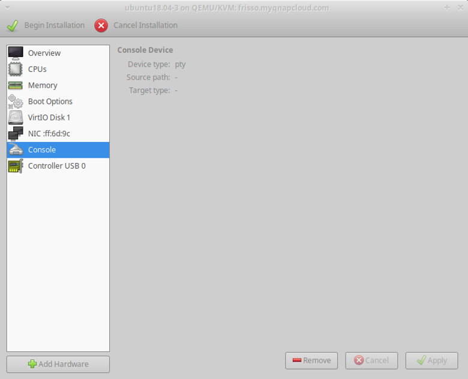

<table style="width:100%">
  <tr>
    <td align="left"><a href="../1.6/README.md">⬅️ Previous</a></td>
    <td align="right"><a href="../1.8/README.md">Next ➡️</a></td>
  </tr>
</table>

# 7. Inspect the Network Configuration

In this section we create a new virtual network using the XML definition and manipulating it to create the network via the CLI. This is mainly done because manipulating the XML allows complete control of the virtual hardware specification, enabling configurations that are not possible using the GUI (e.g., leveraging Open vSwitch as bridging technology).

As mentioned before, a subset of network configurations can also be set via the virt-manager GUI. You can create, delete, or list virtual networks for each hypervisor by selecting a connection, right-clicking on it, and opening **Connection details**. In this view, the **Virtual Networks** tab is available among **Overview** and **Storage**.

> [!NOTE]
> Unless explicitly mentioned, all the following instructions are intended to be executed on the server.

## 7.1. Inspect the "default" Network

After installing Libvirt on a Linux system, a *default virtual network* is provided out of the box. You can verify its configuration by typing:

```bash
virsh net-list --all
```

Output:

```
Name                 State      Autostart
-----------------------------------------
default              active     yes
```

This network is used by the VMs created in previous steps. To inspect the network configuration, it is possible to export every resource described in Libvirt as an XML file. The `virsh` CLI can dump the XML of the network by typing:

```bash
sudo virsh net-dumpxml default
```

Example output:

```xml
<network connections='2'>
  <name>default</name>
  <uuid>fe7073de-9253-4525-9529-9f0f9db345b9</uuid>
  <forward mode='nat'>
    <nat>
      <port start='1024' end='65535'/>
    </nat>
  </forward>
  <bridge name='virbr0' stp='on' delay='0'/>
  <mac address='52:54:00:82:cd:11'/>
  <ip address='192.168.122.1' netmask='255.255.255.0'>
    <dhcp>
      <range start='192.168.122.2' end='192.168.122.254'/>
    </dhcp>
  </ip>
</network>
```

### 7.1.1. Key Parameters

- **Forward mode:** Describes how traffic is routed from VMs to the Internet.
  - **`nat` forwarding ("virtual networks"):** Operates in NAT mode using IP masquerading. Guests use the hypervisor IP to reach external destinations but cannot receive incoming traffic from outside.
  - **`routed` networking ("shared physical device"):** The virtual switch is connected directly to the host LAN, passing guest traffic without NAT. This allows external communication with guest VMs.
  - If the `forward` section is absent, the network is isolated.

- **Bridge name:** Indicates which software bridge is used to connect virtual NICs of VMs in this network.
- **IP element:** Each virtual switch can provide a range of IPs via DHCP, using **dnsmasq**, automatically configured and managed by Libvirt.

When added to a network, vNICs are attached to the virtual bridge indicated in the specification. To verify this, inspect the `virbr0` bridge to see which vNICs are connected:

```bash
sudo brctl show
```

Example output:

```
bridge name	bridge id		     STP enabled	   interfaces
virbr0      8000.52540082cd11	   yes             virbr0-nic
                                                 vnet0
                                                 vnet1
```

You can also find which MAC addresses correspond to which vNIC and detect which VM is attached:

```bash
sudo brctl showmacs virbr0
```

From **virt-manager**, clicking on a specific VM in the hardware view reveals the NIC MAC address.

## 7.2. Create a New Virtual Network

Starting from the default network, extract the configuration into a file:

```bash
sudo virsh net-dumpxml default > br1.xml
```

Then modify the following fields in `br1.xml`:

- Change the **network name** (names must be unique).
- Delete the **UUID** (it will be regenerated by Libvirt at creation time).
- Change the **bridge name** (if it does not exist, Libvirt will create it).
- Delete the **MAC address** (it will be regenerated).
- Remove the **forwarding** section to create an internal network.
- Assign another **subnet** in the `ip` element, adjusting the `dhcp` configuration accordingly.

Validate the network file:

```bash
sudo virsh net-define br1.xml
```

Then start the new network:

```bash
sudo virsh net-start <name-of-the-network>
```



If the network is created successfully, you can add a new NIC to the VMs (after shutting them down). In **virt-manager**, go to the hardware information view and attach the new NIC to the newly created network.

You can test connectivity using **iperf** in this network as done with the default network.

> [!NOTE]
> Remember to check the status of the newly created network interface, bring it up, and request an IP address if necessary:

```bash
sudo ip link set <interface_name> up
sudo dhclient -v <interface_name>
```