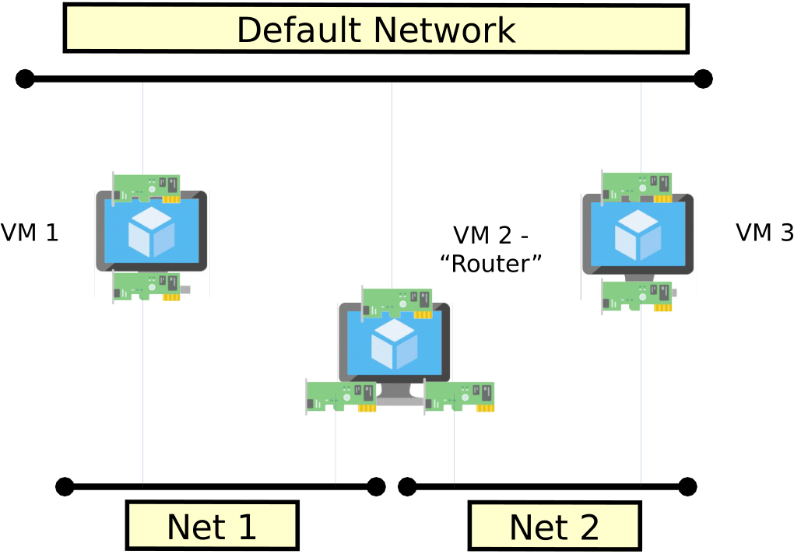

<table style="width:100%">
  <tr>
    <td align="left"><a href="../1.7/README.md">⬅️ Previous</a></td>
  </tr>
</table>

# 8. Exchange Traffic Between Two VMs Through a Third VM Acting as Router



In this section, a more advanced exercise is proposed, combining topics discussed in the previous sections. Therefore, instructions are less extensive, and it is up to the reader to combine them together to satisfy the requirements.

As discussed in the previous section, virtual networks can be combined to create multiple topologies and route traffic across VMs. In this exercise, we create the topology depicted above: two VMs should communicate using a dedicated secondary vNIC connected via a **router VM**.

## 8.1. Steps

- **Create two internal networks** without overlapping IPs.  
  **Suggestion (1):** Enable DHCP to simplify IP assignment.

- **Create two VMs** with two NICs each using the **VirtIO driver**.  
  - The first NIC should be connected to the **default virtual network** (or another accessible network).  
  - The second NIC should be connected to one of the two internal virtual networks respectively.

- **Create the Router VM** and attach three vNICs to it:  
  - One for the management network.  
  - Two for interconnecting the internal virtual networks.

- **Configure NICs** in the three VMs to enable routing.  
  - Enable `ip_forwarding` on the router VM.  
  - Configure the appropriate routes on the other VMs.

- **Verify the topology** with the following tests:

  - Ping the IP of the vNIC of VM3 from VM1 to assess reachability.  
  - Use `traceroute` to verify packets traverse the router correctly.  
  - Test bandwidth using **iperf** as presented in the related section, between VM1 and VM3.

The results obtained by testing the performance with **iperf** in this exercise will be used in the next one to compare the performance of paravirtualized and emulated network cards.

## 8.2. Useful Commands

Below is a list of useful commands to complete the exercise.

- **Enable IP forwarding** to let a Linux system act as a router:

  ```bash
  sudo sysctl -w net.ipv4.ip_forward=1
  ```

- **Create a dedicated route** using `ip route`:

  ```bash
  sudo ip route add <destination_network> via <gateway_ip>
  ```

- **Request an IP using DHCP**:

  ```bash
  sudo dhclient -v <interface_name>
  ```