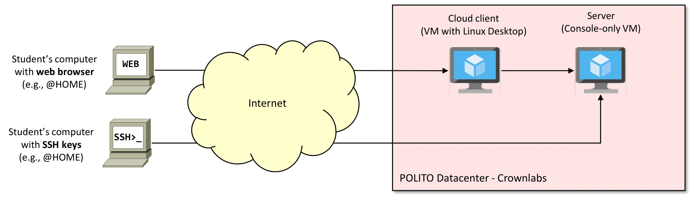

<table style="width:100%">
  <tr>
    <td align="left"><a href="../README.md">⬅️ Previous</a></td>
    <td align="right"><a href="../1.2/README.md">Next ➡️</a></td>
  </tr>
</table>

# 1. Physical Setup

For this lab, two possible configurations are possible:

 - This lab requires a physical setup such as depicted in Figure 1. Each student will be provided with a couple of VMs running in the POLITO datacenter, accessible through the **Crownlabs dashboard**, which represents a **client** and a server.
   
   

    
   

   
<em>Figure 1: Physical setup — how to connect to your virtualized resources.</em>

   A Linux (or equivalent) client, using the **"Cloud Client" template**, should be provisioned. This machine represents our **management host**, which is used to configure our (remote) server environment, the **Cloud Computing: Docker" laboratory template**.

   On the **server** side, this lab operates with a single VM, where we can complete all our exercises.

 - **PREFERRED**. Alternatively, if you created an **SSH key** on your local machine and copied it in the **Crownlabs dashboard**, you can directly connect through SSH to the Server VM (**Cloud Computing: Docker" laboratory template**), avoiding the use of the Client VM. Please follow the instructions on the CrownLabs website (section *Resources*) if you want to explore this method.
