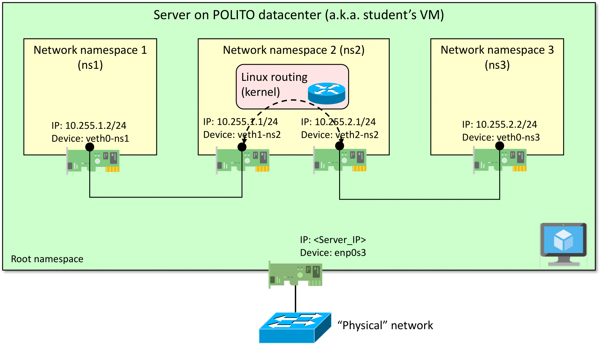
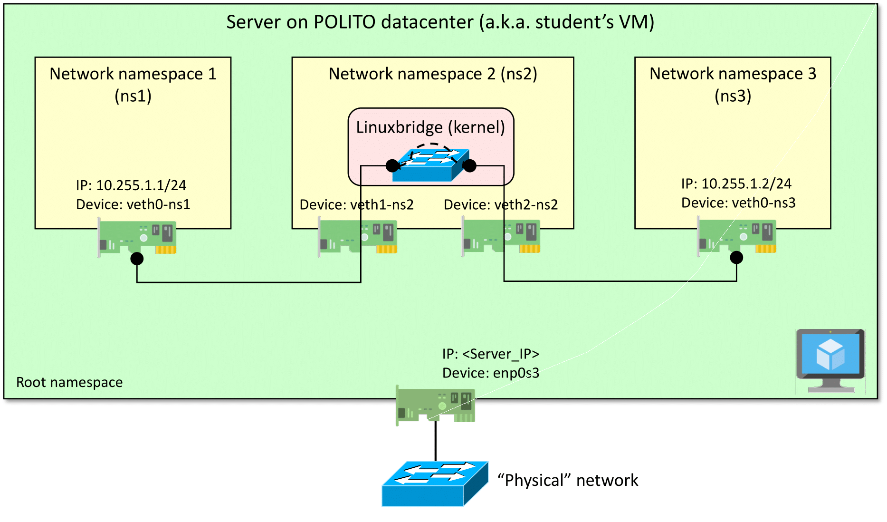

<table style="width:100%">
  <tr>
    <td align="left"><a href="../1.5/README.md">⬅️ Previous</a></td>
    <td align="right"><a href="../1.7/README.md">Next ➡️</a></td>
  </tr>
</table>

# 6. Network Namespaces: Exchanging Traffic Between Multiple Namespaces and the Host

A **`NET` namespace** allows two processes to perceive completely different and independent network setups.
In other words, each `NET` namespace has its own set of IP addresses, its own routing table, firewall rules, and so on — even the loopback interface is separate.

Whenever a new network namespace is created, it contains only a **loopback interface**.
Afterward, it is possible to attach either physical or virtual interfaces to the newly created namespace (each network interface belongs to exactly one namespace).


## 6.1. Creating the First Network Namespace

In the following, you will create two `NET` namespaces, interconnect them, and configure them to communicate with each other, achieving the topology shown above.

To begin, create your first namespace named `ns1`:

```bash
# Create a new network namespace called 'ns1'
sudo ip netns add ns1
```

The **list** of available `NET` namespaces is visible by typing:

```bash
ip netns list
```

(or, more simply, `ip netns`).

A **command** (e.g., running an application) can be issued in the newly created namespace with:

```bash
ip netns exec <namespace_name> <command>
```

For instance, to show the network interfaces available within `ns1`:

```bash
sudo ip netns exec ns1 ip link
```

You should only see the `lo` (loopback) interface, with state `DOWN`.

---

## 6.2. Enabling the Loopback Interface

Let’s enable the loopback interface and verify it works with a ping to `localhost` within the namespace:

```bash
# Move the state of device loopback ('dev lo') to up
sudo ip netns exec ns1 ip link set dev lo up
sudo ip netns exec ns1 ping 127.0.0.1
```

> **Note:** If the loopback device is *down*, you cannot ping either the loopback address or any other address in the namespace (such as `10.255.1.2`, which will be configured later).

---

## 6.3. Connecting the Namespace to the Root Namespace

Now, we need to connect the `ns1` namespace to the **root namespace**.
To do this, we create a **Virtual Ethernet Device (`veth`)**, which acts as a virtual wire with two ends, each attached to a different namespace.

A `veth` acts as a tunnel, allowing traffic to cross namespace boundaries.

```bash
# Create the first virtual Ethernet link (i.e., 'veth' pair)
# The two ends are virtual interfaces called 'veth0-root' and 'veth0-ns1'
sudo ip link add veth0-root type veth peer name veth0-ns1

# Attach one side of the veth pair ('veth0-ns1') to the namespace 'ns1'
sudo ip link set veth0-ns1 netns ns1
```

Alternatively, the entire operation can be done in a single command:

```bash
sudo ip link add veth0-root type veth peer name veth0-ns1 netns ns1
```

## 6.4. Assigning IP Addresses

Once the `veth` is created, assign IP addresses to both ends and verify connectivity.

### 6.4.1. Namespace side

```bash
# veth0-ns1 configuration (ns1 namespace)
sudo ip netns exec ns1 ip link set veth0-ns1 up
sudo ip netns exec ns1 ip addr add 10.255.1.2/24 dev veth0-ns1
```

At this point:

```bash
# Ping from the root namespace: expect no reply
ping 10.255.1.2

# Ping from the ns1 namespace: expect success
sudo ip netns exec ns1 ping 10.255.1.2
```

### 6.4.2. Root namespace side

```bash
# veth0-root configuration (root namespace)
sudo ip link set veth0-root up
sudo ip addr add 10.255.1.1/24 dev veth0-root

# Connectivity check
# From root, contacting ns1:
ping 10.255.1.2

# From ns1, contacting root:
sudo ip netns exec ns1 ping 10.255.1.1
```

If both pings succeed, you have successfully created IP connectivity between `ns1` and the root namespace.

> [!TIP]
> The interface `veth0-root` is attached to the root namespace and can be configured with standard `ip` commands.
> The interface `veth0-ns1` belongs to `ns1`, so every command must be prefixed with `ip netns exec ns1`.

---

## 6.5. Adding a Second Namespace and Enabling IP Forwarding

Now, repeat the previous steps to create a second namespace (`ns2`), a new `veth` pair, and configure the IP addresses.

Next, enable IP forwarding in the root namespace to make it act as a router:

```bash
sudo sysctl net.ipv4.ip_forward=1
```

Additionally, ensure the firewall policy allows forwarding:

```bash
sudo iptables -P FORWARD ACCEPT
```

---

### 6.5.1. Testing Connectivity

When trying to ping from one namespace to the other, you will notice they are not reachable:

```bash
sudo ip netns exec ns1 ping 10.255.2.2
```

> [!HINT] 
> The issue lies in the **routing tables**.
> Each namespace must know how to reach the other via the root namespace.

Add the routes using:

```bash
sudo ip route add {NETWORK/MASK} via {GATEWAYIP}
# Example
sudo ip route add 10.10.10.0/24 via 10.10.10.254
```

For this lab:

```bash
sudo ip netns exec ns1 ip route add 10.255.2.0/24 via 10.255.1.1
sudo ip netns exec ns2 ip route add 10.255.1.0/24 via 10.255.2.1
```

Now, the ping should succeed:

```bash
sudo ip netns exec ns1 ping 10.255.2.2
# PING 10.255.2.2 (10.255.2.2) 56(84) bytes of data.
# 64 bytes from 10.255.2.2: icmp_seq=1 ttl=63 time=0.055 ms
# 64 bytes from 10.255.2.2: icmp_seq=2 ttl=63 time=0.043 ms
```


## 6.6. Full Configuration Script

If you encounter problems, use this script snippet that sets everything up automatically:

```bash
sudo ip netns add ns1
sudo ip netns add ns2

sudo ip netns exec ns1 ip link set dev lo up
sudo ip netns exec ns2 ip link set dev lo up
sudo ip link add veth0-root type veth peer name veth0-ns1 netns ns1
sudo ip link add veth1-root type veth peer name veth1-ns2 netns ns2

sudo ip netns exec ns1 ip link set veth0-ns1 up
sudo ip netns exec ns2 ip link set veth1-ns2 up
sudo ip netns exec ns1 ip addr add 10.255.1.2/24 dev veth0-ns1
sudo ip netns exec ns2 ip addr add 10.255.2.2/24 dev veth1-ns2

sudo ip link set veth0-root up
sudo ip link set veth1-root up
sudo ip addr add 10.255.1.1/24 dev veth0-root
sudo ip addr add 10.255.2.1/24 dev veth1-root

sudo sysctl net.ipv4.ip_forward=1
sudo iptables -P FORWARD ACCEPT

sudo ip netns exec ns1 ip route add 10.255.2.0/24 via 10.255.1.1
sudo ip netns exec ns2 ip route add 10.255.1.0/24 via 10.255.2.1
```

Once configured, the two namespaces should be able to ping each other successfully.

---

## 6.7. Cleaning Up

Before moving on, clean up the environment:

```bash
sudo ip netns delete ns1
sudo ip netns delete ns2
```

Deleting the namespaces also removes the associated `veth` interfaces and routes.

---

# Extra - Network Namespaces: Connecting Two Namespaces with a Router (No Solution)

In this exercise, you will create and configure the topology shown below, where IP forwarding is handled by a **third namespace** acting as a router.



Use standard network analysis tools (e.g., `tcpdump`) to verify:

1. Traffic is exchanged as expected when you ping one namespace from another.
2. Standard IP networking tools can be used within namespaces.

> **Note:**
> Do **not** attach the physical interface to the second namespace — doing so would prevent external SSH access to the host.

With this setup, all three namespaces can communicate with each other, but **not** with the Internet.

This exercise is left to the student; no solution is provided here.

---

# Extra - Network Namespaces: Connecting Two Namespaces with a Bridge (No Solution)

In this exercise, the third namespace acts as a **data-link bridge** instead of a router, providing direct Layer 2 connectivity between the two endpoints.
This means that the IP addresses of `ns1` and `ns3` will be in the same network, while interfaces in `ns2` will have **no IP address**.



To create a bridge and attach interfaces to it, refer to the [Linux Foundation Networking Bridge documentation](https://wiki.linuxfoundation.org/networking/bridge).

Again, use tools like `tcpdump` to verify that:

1. Traffic is exchanged as expected between namespaces.
2. Standard IP networking tools can operate inside namespaces.

This exercise is left to the student; no solution is provided here.

