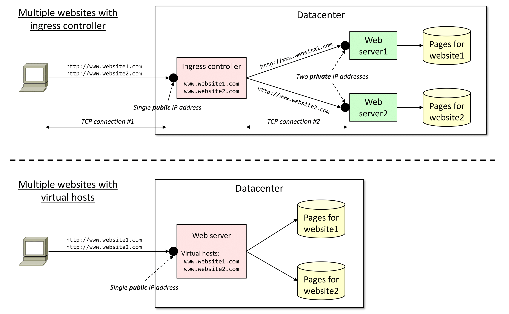

<table style="width:100%">
  <tr>
    <td align="left"><a href="../1.4/README.md">⬅️ Previous</a></td>
    <td align="right"><a href="../README.md">End ✅</a></td>
  </tr>
</table>

# 5. Expose an application using Kubernetes

There are several ways to expose an application outside a Kubernetes
cluster.

Services are an abstract way of exposing an application running on a set
of pods as a network service. A service provides a single point of
access from outside the Kubernetes cluster and allows you to dynamically
access a group of replica pods.

For internal application access within a Kubernetes cluster, a
`ClusterIP` service is the preferred method. It is a default setting in
Kubernetes and uses an internal IP address to access the service.

To expose a service to external network requests, `NodePort` and
`LoadBalancer` services, and `Ingress` resources are possible options.
The key advantage of using an ingress resource is that it makes possible
to expose multiple services using a single abstract endpoint, a load
balancer, or both at once. Taking this approach, different applications
can enact host, prefix, and other rules to route traffic to defined
service resources however they prefer.

Let’s deploy an application:
```sh
    kubectl apply -f https://raw.githubusercontent.com/liqotech/microservices-demo/master/release/kubernetes-manifests.yaml
```
## Services

We may observe that this a micro-service based website, with multiple
deployments and service. The “frontend” service exposes a web server to
serve the end-user.

### Exercise

Let’s have a look at the services we just created:

- How can we access to the front-end service?

- Why does the “frontend-external” service remain with a “Pending”
  external IP?

## Ingress

An Ingress exposes HTTP and HTTPS routes from outside the cluster to
services within the cluster. Traffic routing is controlled by rules
defined on the Ingress resource.

### Exercise

With the commands you used in the previous exercise create a deployment
and a service.

An Ingress may be configured to give services externally-reachable URLs,
load balance traffic, terminate SSL/TLS, and offer name-based virtual
hosting. An Ingress does not expose arbitrary ports or protocols.
Exposing services other than HTTP and HTTPS to the Internet typically
uses a service of type NodePort or LoadBalancer.

Despite the ingress resources are native in Kubernetes, similar as for
the CNI, there is **no default ingress controller provided at Kubernetes
installation**.

Therefore, we need to install a specific ingress controller to
effectively expose application without having to rely on services. In
this section, we will install an ingress-controller based on the NGINX
web server. The goal of this Ingress controller is the assembly the
NGINX configuration file (nginx.conf) in the ingress-controller pod.

NGINX Ingress Controller can be easily installed via:
```sh
    kubectl apply -f https://raw.githubusercontent.com/kubernetes/ingress-nginx/controller-v1.1.1/deploy/static/provider/baremetal/deploy.yaml
```
Additionally, let configure the NGINX Ingress Controller as the default
one, so that each new ingress resource is automatically bound to it:
```sh
    kubectl annotate ingressclass nginx ingressclass.kubernetes.io/is-default-class=true
```
If we observe the services exposed
(`kubectl get services -n ingress-nginx`), we may notice that we can
access the ingress-controller using a NodePort service since we do not
have any external integration for a LoadBalancer service.

This apply will create a custom namespace. Let’s investigate which pod
are deployed:
```sh
    kubectl get po -n ingress-nginx
```
### Exercise

Let’s inspect the frontend service of the application we just deployed:

- Can we access it directly? If yes, how?

- Let’s create an Ingress with the following values. What parts of the
  infrastructure are missing to properly use it?

enumerate itemize

``` yaml
apiVersion: networking.k8s.io/v1
kind: Ingress
metadata:
  name: minimal-ingress
spec:
  rules:
   - host: www.example.local
     http:
      paths:
      - path: /
        pathType: Prefix
        backend:
          service:
            name: frontend
            port:
              number: 80
```

Let’s try if the ingress configuration is effective:
```sh
    kubectl get ingress
```

```
    NAMESPACE   NAME              CLASS   HOSTS               ADDRESS         PORTS
    default     minimal-ingress   nginx   www.example.local   172.16.134.52   80, 443
```
Despite the cluster has not external DNS integration, we can test the
functionality of the ingress using curl:
```sh
    curl -H "Host: www.example.local" ADDRESS:NODE_PORT
```
**Warning:** since the ingress controller is exposed through a NodePort
service, it cannot be accessed directly on port 80. Instead, it is
necessary to use the corresponding NodePort, which can be retrieved from
the ingress controller service
(`kubectl get services -n ingress-nginx`).

The `-H` option adds a custom headers to our request. We specified the
‘`www.example.local`’ host, which enables to the ingress controller to
redirect our request to the specific webserver in charge of that website
using the *domain name* instead of the server *IP address*. This allows
re-using the same IP address for different websites, served by different
(and independent) web servers, as shown in
<a href="#fig:ingress-vhost" data-reference-type="ref+label"
data-reference="fig:ingress-vhost">7.1</a>.

### Ingress resources vs. virtual hosts

While sometimes it seems that the ingress controller looks similar to
have a webserver (such as `nginx` or `apache`) hosting multiple websites
(i.e., *virtual hosts*), actually is this rather different.

In fact, the ingress controller will redirect the requests to *multiple*
independent web servers, while the virtual host primitive will create
multiple domains within the *same* web server. As a consequence, the
Ingress controller enables each website to be updated (e.g., restarted,
updated content, etc.) independently from the others. In addition, this
allows the two different webservers to be controlled by different users.

Instead, with the virtual host mechanism any modification required by a
single webserver (e.g., a configuration update requiring a restart of
the process) may impact also on the second webserver; in addition, we
cannot allow two independent users to control the unique webserver.

On the other side, the ingress controller requires multiple running
processes (i.e., pods; namely, one for the ingress controller, and
another for each webserver) and the necessity to split the TCP
connection (the first connection terminates on the ingress controller,
while a second TCP connection is established between the ingress and the
actual web server). Instead, the virtual hosts mechanism requires a
single process (i.e., pod) independently from the number of configured
virtual hosts, and a single TCP connection.

<p id="fig:ingress-vhost" align="center">
    
</p>
<p align="center">
    <em>
    Different setup of two web servers sharing a single IP public address: with Kubernetes ingress controller (top), and with the virtual host primitive (bottom).
    </em>
</p>